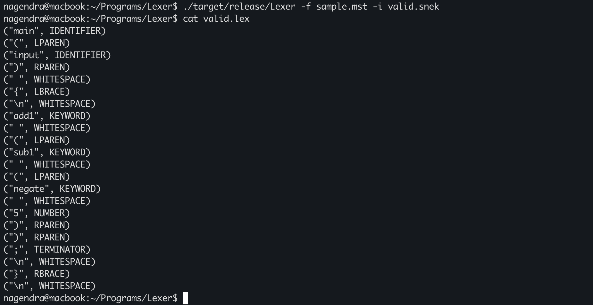
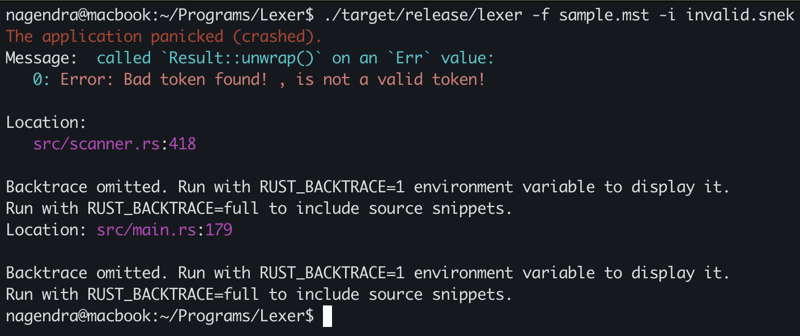
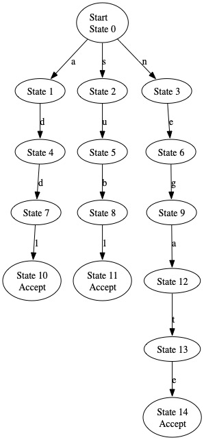
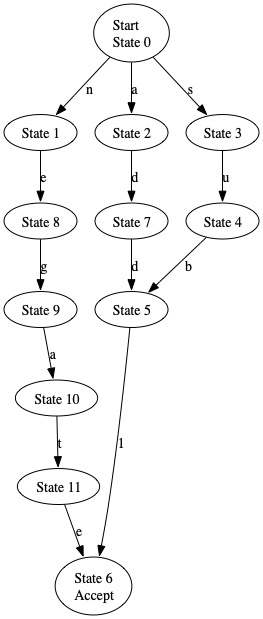
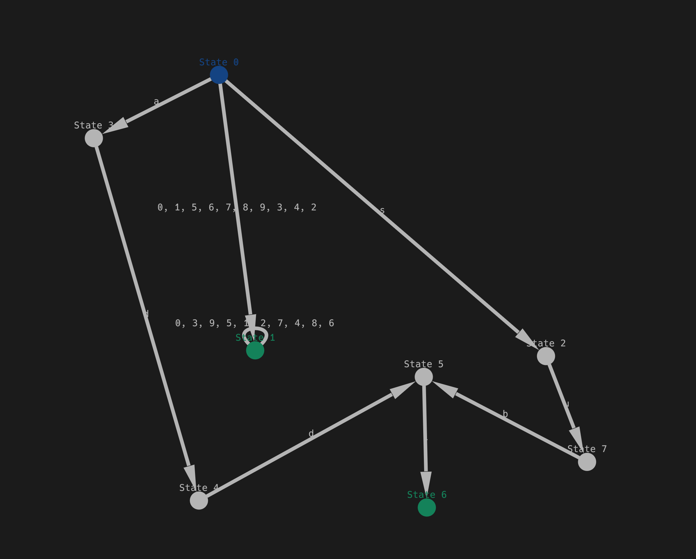

# Introduction
An attempt at a customizable lexer for learning purposes. Ideally, this should be able to lex any programming language you are interested in as long as you can specify the micro-syntax rules for each syntactic category in your desired language.

Since this program was built with the snek programming languages in mind, it has only been tested on them.

This program is built by following the material "Engineering a Compiler (2e) by Keith Cooper and Linda Torczan", and is entirely in Rust.

# How To Use This Program

To use this program simply clone the repo and run with the following command:
 
`cargo run --release (-f <input mst file>  OR  -r r1 c1 -r r2 c2...) -i <input source program file> [-o <output file path>] [-n] [-d] [-m]`

The different options as follows:

- --microsyntax-file [-f] : A file containing the microsyntax rule and the syntactic category it describes. The file is a simple ASCII text file where each line is an entry containing a regular expression and a syntactic category separated by "::". The order of the syntactic categories in the file specifies the priority in which detected tokens are matched into syntactic categories. An example microsyntax file is shown below.

 

- --microsyntax [-r] : Provide the regular expression for a syntactic category and its category name separated by a space directly as a command line argument. Either a microsyntax file or a list of microsyntax rules must be provided.

 

- --input [-i] : The input source file to lex. This is a required argument.

 

- --output [-o] : The output file where the detected tokens and their categories are saved. If none is provided, a default file with the same name as the input file with the `.lex` extension is created within the current directory.

 

- --save-nfa [-n] : Save the NFA created from the Thompson Construction of the regular expression which accepts all valid tokens in your language. The NFA is stored in a `.dot` file which follows the graphviz graph notation format. A `.jpg` file showing the state diagram is also saved.

 

- --save-dfa [-d] : Save the DFA created after applying the Subset Construction algorithm to the NFA created previously. The DFA is also stored in the `.dot` and `.jpg` file formats.

 

- --save-minimal-dfa [-m] : Save the minimal DFA created after applying Hopcroft's algorithm to the DFA created previously. The minimized DFA here still has different terminal states for different syntactic categories, hence this is not the smallest possible DFA that can be created. This is done to help with token identification later when scanning the input. The minimal DFA is again stored in `.dot` and `.jpg` file formats.

 

- --skip-whitespace [-w] : If spaces are semantically meaningless in your language, you can enable this option and the scanner will ignore any whitespace characters detected in the input stream, even if no whitespace syntactic category is defined in your microsyntax file. *CAUTION* Currently this detects whitespaces even inside string constants, this needs to be addressed at a later time.

 

- --visualize [-v] : Visualize the finite automata created by the tool, takes one of NFA, DFA or MINIMAL as an option and opens an interactive window which shows the finite automata selected.

# Example microsyntax file

[0-9]+::NUMBER
 
add1|sub1|negate::KEYWORD
 
[a-z]+::LOWERCASE

# Supported Regex Operations
- () : Grouping
- [abc] : Character Sets
- [a-c] : Simple Character Range
- \* : Kleene Closure for zero or more occurences
- \+ : Kleene Closure for one or more occurences
- ? : Operator for zero or one occurence

# Supported Escape Characters
- \n : Newline
- \t : Tab
- \r : Carriage Return
- \\\\ : Backslash
- \\\( : Left parenthesis
- \\\) : Right paranthesis
- \\\[ : Left Bracket
- \\\] : Right Bracket
- \\\| : Pipe
- \\\* : Asterisk
- \\\+ : Plus
- \\\? : Question

# Sample Output

## Sample Output for a Valid Program

## Sample Output for an Invalid Program

## Sample NFA

## Sample DFA

## Sample Minimal DFA

## Sample Visualization

